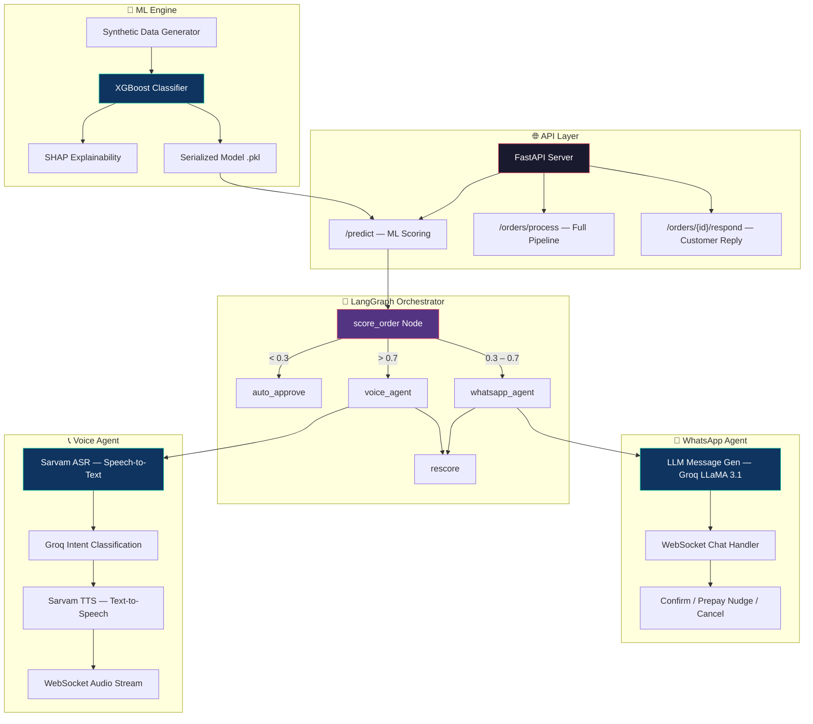
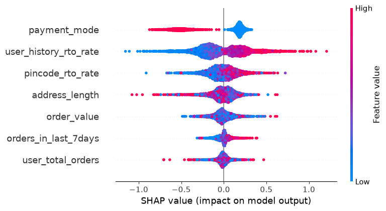

<p align="center">
  
</p>

<h1 align="center">RTO Guardian</h1>
<h3 align="center">
  <em>AI-Powered Return-to-Origin Prevention for Indian E-Commerce</em>
</h3>

<p align="center">
  
  
  
  
  
  
  
</p>

<p align="center">
  <strong>RTO Guardian</strong> is an intelligent, end-to-end system that predicts high-risk Cash-on-Delivery (COD) orders <br/>
  and proactively intervenes via <b>AI-driven WhatsApp chatbots</b> and <b>multilingual voice calls</b> — <br/>
  <b>before</b> the package even ships — saving Indian D2C brands from the ₹25,000 Cr/year RTO crisis.
</p>

---

## 📌 The Problem — Why This Matters

> **Return to Origin (RTO)** is the #1 profitability killer for Indian e-commerce.

| Metric | Value |
|:---|:---|
| 📦 India's annual RTO cost | **₹25,000+ Crore** (~$3B USD) |
| 🚚 COD orders that get returned | **25–40%** |
| 💸 Cost per failed delivery | **₹100–200** (shipping + reverse logistics) |
| 🏪 Platforms most affected | Meesho, Shopify India, D2C brands |

**Root Causes:** Fake/impulsive orders, vague addresses, buyer's remorse, and zero pre-shipment verification.

**Current Solutions Fail** because they either block legitimate customers (hurting conversion) or catch fraud only *after* shipping (too late).

---

## 💡 Our Solution

RTO Guardian takes a **predict → intervene → convert** approach:

```
┌──────────────┐     ┌──────────────────┐     ┌───────────────────┐
│  📊 ML Risk  │────▶│  🤖 LangGraph    │────▶│  ✅ Final         │
│   Scoring    │     │   Orchestrator   │     │   Decision        │
│  (XGBoost)   │     │  (Agent Router)  │     │  (Rescore + Ship) │
└──────────────┘     └──────────────────┘     └───────────────────┘
                            │
              ┌─────────────┼─────────────┐
              ▼             ▼             ▼
        ┌──────────┐ ┌───────────┐ ┌───────────┐
        │ ✅ Auto  │ │ 💬 WhatsApp│ │ 📞 Voice  │
        │ Approve  │ │  Chatbot  │ │   Call    │
        │ (Low)    │ │  (Medium) │ │  (High)   │
        └──────────┘ └───────────┘ └───────────┘
```

**Instead of blindly blocking risky orders, we *talk* to the customer and give them a chance to confirm, pay online, or update their address — converting potential RTOs into successful deliveries.**

---

## 🏗️ System Architecture



---

## 🌟 Key Features

### 1. 📊 ML Risk Scoring Engine
- **XGBoost classifier** trained on 10,000 synthetic orders with realistic Indian e-commerce distributions
- **7 engineered features**: RTO history, payment mode, order value, address quality, pincode risk, order velocity
- **SHAP explainability** — every prediction is interpretable (crucial for business trust)
- **3-tier risk routing**: LOW (auto-approve) → MEDIUM (WhatsApp) → HIGH (voice call)

<details>
<summary>📈 SHAP Feature Importance (Click to expand)</summary>
<br/>
<p align="center">
  
</p>

> `payment_mode` (COD vs Prepaid) is the strongest predictor, followed by `user_history_rto_rate` and `pincode_rto_rate`.
</details>

### 2. 🔀 LangGraph Agentic Orchestrator
- **Stateful workflow** built on LangGraph `StateGraph` with conditional routing
- Automatically selects the right intervention agent based on risk score
- Full **order state machine** tracking: scoring → agent action → rescoring → final decision
- Post-interaction **dynamic rescoring** adjusts risk based on customer response

### 3. 💬 WhatsApp Confirmation Agent (Medium Risk)
- **Real-time WebSocket chat** simulating WhatsApp UX
- **LLM-powered Hinglish messages** via Groq (LLaMA 3.1 8B) — feels natural, not robotic
- **Intelligent prepay nudge**: if user hesitates for 10 seconds, offers ₹30 cashback to switch from COD to UPI
- **3 outcomes**: Confirm ✅ → Ship | Prepay 💰 → Ship + Cashback | Cancel ❌ → Don't Ship
- Typing indicators, timed responses, and conversation state tracking for realistic UX

### 4. 📞 Multilingual Voice Call Agent (High Risk)
- **Full-duplex audio over WebSocket** — real-time voice conversation
- **Sarvam AI** integration for Indian-language ASR (Speech-to-Text) and TTS (Text-to-Speech)
- **Groq LLaMA 3.1** for real-time intent classification (Hindi/Hinglish/English)
- **Multi-turn state machine**: Language Select → Greeting → Order Confirm → Landmark Collection → Closing
- **Landmark extraction** to improve delivery accuracy and reduce address-based RTOs
- Supports **Hindi, Hinglish, and English** dynamically based on customer preference

### 5. 🔄 Dynamic Rescoring Engine
- Post-agent **multiplier-based rescoring** reflects real user actions
- Confirmed → 70% risk reduction | Prepaid → 90% reduction | Declined → 50% risk increase
- Final decision: `APPROVED` / `CANCELLED` / `ESCALATED` (manual review queue)

---

## 🛠️ Tech Stack

| Layer | Technology | Purpose |
|:---|:---|:---|
| **API Framework** | FastAPI + Uvicorn | Async REST API + WebSocket server |
| **ML Model** | XGBoost + scikit-learn | Binary classification (RTO vs Delivered) |
| **Explainability** | SHAP + Matplotlib | Model interpretability for business stakeholders |
| **Orchestration** | LangGraph | Stateful agentic workflow with conditional routing |
| **LLM (Text)** | Groq Cloud (LLaMA 3.1 8B) | Intent classification, message generation, landmark extraction |
| **Voice ASR** | Sarvam AI (Speech-to-Text) | Indian-language audio transcription |
| **Voice TTS** | Sarvam AI (Text-to-Speech) | Natural Hindi/English speech synthesis |
| **Real-time Comms** | WebSockets | Full-duplex chat and voice streaming |
| **Data Modeling** | Pydantic + TypedDict | Schema validation and state management |
| **Data Generation** | NumPy + Pandas | Synthetic dataset with realistic Indian e-commerce distributions |

---

## 📁 Project Structure

```
rto_guardian/
├── backend/
│   ├── app/
│   │   ├── main.py                    # FastAPI app — REST endpoints + startup
│   │   ├── agents/
│   │   │   ├── orchestrator.py        # LangGraph StateGraph — workflow engine
│   │   │   ├── auto_approve.py        # Low-risk auto-approve node
│   │   │   ├── whatsapp.py            # WhatsApp conversation state machine
│   │   │   ├── voice.py               # Voice call system prompt + conversation tree
│   │   │   ├── voice_agent.py         # Live voice agent (ASR → Groq → TTS loop)
│   │   │   ├── groq_parser.py         # LLM intent classification + landmark extraction
│   │   │   └── message_generator.py   # Hinglish message generation via Groq
│   │   ├── models/
│   │   │   └── schemas.py             # Pydantic + TypedDict schemas
│   │   ├── services/
│   │   │   └── sarvam_service.py      # Sarvam AI ASR/TTS integration
│   │   └── websockets/
│   │       ├── chat_handler.py        # WhatsApp WebSocket endpoint
│   │       └── voice_ws_handler.py    # Voice call WebSocket endpoint
│   ├── ml/
│   │   ├── data_generator.py          # Synthetic dataset creation (10K rows)
│   │   ├── train.py                   # XGBoost training + SHAP + model export
│   │   ├── synthetic_data.csv         # Generated training data
│   │   ├── shap_summary.png           # SHAP feature importance visualization
│   │   └── models/
│   │       └── rto_risk_model.pkl     # Serialized model bundle
│   └── requirements.txt
├── LICENSE                            # MIT License
└── README.md
```

---

## 🚀 Getting Started

### Prerequisites
- Python 3.11+
- API Keys: [Groq](https://console.groq.com/) (free) and [Sarvam AI](https://www.sarvam.ai/) (for voice features)

### Installation

```bash
# 1. Clone the repository
git clone https://github.com/aarthireddyyy/rto-guardian.git
cd rto-guardian

# 2. Create and activate virtual environment
python -m venv venv
source venv/bin/activate        # Linux/Mac
venv\Scripts\activate           # Windows

# 3. Install dependencies
pip install -r backend/requirements.txt

# 4. Set up environment variables
cp backend/.env.example backend/.env
# Edit backend/.env with your API keys:
#   GROQ_API_KEY=gsk_your_key_here
#   SARVAM_API_KEY=your_key_here
```

### Train the ML Model (Optional — pre-trained model included)

```bash
cd backend/ml
python data_generator.py    # Generate 10K synthetic orders
python train.py             # Train XGBoost + generate SHAP plot
```

### Run the Server

```bash
cd backend
uvicorn app.main:app --host 0.0.0.0 --port 8080 --reload
```

The API is now live at `http://localhost:8080` — explore the interactive docs at [`/docs`](http://localhost:8080/docs).

---

## 📡 API Reference

### `POST /predict` — Score a single order

```bash
curl -X POST http://localhost:8080/predict \
  -H "Content-Type: application/json" \
  -d '{
    "user_history_rto_rate": 0.6,
    "user_total_orders": 3,
    "orders_in_last_7days": 2,
    "payment_mode": "COD",
    "order_value": 1200,
    "address_length": 20,
    "pincode_rto_rate": 0.4
  }'
```

**Response:**
```json
{
  "risk_score": 0.8234,
  "risk_tier": "HIGH",
  "should_approve": false,
  "intervention": "voice_call"
}
```

### `POST /orders/process` — Full pipeline (Score → Route → Agent)

```bash
curl -X POST http://localhost:8080/orders/process \
  -H "Content-Type: application/json" \
  -d '{
    "order_id": "ORD-2026-001",
    "customer_name": "Priya Sharma",
    "phone": "+919876543210",
    "address": "Flat 4B, MG Road",
    "pincode": "560001",
    "order_value": 899,
    "payment_mode": "COD",
    "user_history_rto_rate": 0.45,
    "user_total_orders": 5,
    "orders_in_last_7days": 2,
    "pincode_rto_rate": 0.3
  }'
```

### `WebSocket /ws/chat/{order_id}` — WhatsApp conversation
### `WebSocket /ws/voice/{order_id}` — Voice call session

---

## 🎯 Business Impact (Projected)

| Metric | Without RTO Guardian | With RTO Guardian |
|:---|:---|:---|
| RTO Rate | 25–40% | **12–18%** (estimated) |
| Cost per failed delivery | ₹100–200 | **₹0** (prevented pre-shipment) |
| COD to Prepaid conversion | ~0% | **15–25%** (via prepay nudge) |
| Customer experience | ❌ Orders silently blocked | ✅ Personalized verification |
| Address accuracy | ❌ Vague addresses shipped | ✅ Landmark collected via voice |

---

## 🧠 How It Works — End-to-End Flow

```
📦 New COD Order Placed
        │
        ▼
🧮 ML Risk Scorer (XGBoost)
   Extracts 7 features → Outputs probability [0.0 → 1.0]
        │
        ├── Score < 0.3  →  ✅ AUTO-APPROVE  →  Ship immediately
        │
        ├── Score 0.3–0.7  →  💬 WHATSAPP AGENT
        │   │   Sends Hinglish confirmation message
        │   │   Waits 10s → Sends prepay nudge (₹30 cashback)
        │   │   Customer: Confirm / Prepay / Cancel
        │   └── → RESCORE → Final Decision
        │
        └── Score > 0.7  →  📞 VOICE AGENT
            │   Calls customer in Hindi/English
            │   Confirms order + Collects delivery landmark
            │   Extracts address details via LLM
            └── → RESCORE → Final Decision
```

---

## 🏆 What Makes This Hackathon-Worthy

| Dimension | What We Built |
|:---|:---|
| **Real Problem** | ₹25,000 Cr/year RTO crisis — affecting every Indian e-commerce brand |
| **ML + AI Agents** | XGBoost risk scoring + LangGraph multi-agent orchestration |
| **Multilingual Voice AI** | Hindi/Hinglish/English voice calls with Sarvam ASR/TTS |
| **LLM Integration** | Groq LLaMA 3.1 for intent classification and message generation |
| **Behavioral Nudging** | Smart prepay nudge converts COD → UPI, reducing RTO at the source |
| **Production Architecture** | Async FastAPI, WebSockets, Pydantic schemas, stateful workflows |
| **Explainable AI** | SHAP visualizations make every ML decision transparent |
| **India-First Design** | Hinglish messages, INR pricing, Indian voice models, COD-first logic |

---

## 🗺️ Roadmap

- [ ] 🔌 **Shopify / WooCommerce Plugin** — one-click install for D2C brands
- [ ] 📊 **Merchant Dashboard** — real-time RTO analytics and intervention metrics
- [ ] 🗄️ **PostgreSQL + Redis** — persistent order storage and session caching
- [ ] 🔄 **Feedback Loop** — retrain model weekly on live delivery outcomes
- [ ] 📱 **Twilio / WhatsApp Business API** — production messaging integration
- [ ] 🌐 **Multi-language Expansion** — Tamil, Telugu, Bengali, Marathi voice support

---

## 👨‍💻 Contributing

Contributions are welcome! Please open an issue or submit a pull request.

```bash
# Fork → Clone → Branch → Commit → Push → PR
git checkout -b feature/your-feature
git commit -m "Add your feature"
git push origin feature/your-feature
```

---

## 📄 License

This project is licensed under the **MIT License** — see the [LICENSE](LICENSE) file for details.

---

<p align="center">
  <b>Built with ❤️ for Indian e-commerce</b><br/>
  <sub>Turning potential RTOs into successful deliveries, one conversation at a time.</sub>
</p>
