c<p align="center">
  
</p>

<h1 align="center">RTO Guardian</h1>
<h3 align="center">
  <em>Predict. Intervene. Convert. — Turning potential RTOs into successful deliveries.</em>
</h3>

<p align="center">
  
  
  
  
  
  
  
</p>

<p align="center">
  <b>RTO Guardian</b> is an AI-powered, end-to-end pre-shipment intervention system that<br/>
  predicts high-risk COD orders using ML and <b>proactively talks to the customer</b> —<br/>
  via <b>WhatsApp chatbot</b> or <b>multilingual voice call</b> — <b>before</b> the package ever ships.<br/><br/>
  <b>No more shipping and praying. No more blocking good customers.</b>
</p>

---

## 📌 The Problem — ₹25,000 Crore Bleeding Out

> **Return to Origin (RTO) is the single biggest profitability killer in Indian e-commerce — and Meesho sits at ground zero.**

| Metric | The Hard Truth |
|:---|:---|
| 📦 India's annual RTO cost | **₹25,000+ Crore** (~$3 Billion USD) |
| 🚚 COD orders returned on Meesho | **25–40%** of all COD shipments |
| 💸 Cost per failed delivery | **₹100–200** (forward + reverse logistics, wasted) |
| 📉 Seller impact | Lost inventory value, delayed payouts, seller churn |
| 🏷️ Who pays? | Meesho absorbs logistics cost. Seller absorbs trust erosion. |

### Why does this keep happening?

| Root Cause | What Happens |
|:---|:---|
| **Impulsive COD orders** | Customer orders at midnight, regrets by morning. Nobody asks "Are you sure?" |
| **Fake/Vague addresses** | "Near temple, Ward 4" — delivery boy can't locate, marks as undeliverable |
| **Zero pre-shipment verification** | Order goes straight to warehouse → shipped → failed → returned |
| **Buyer's remorse** | Customer found it cheaper elsewhere, or just changed their mind |

### Why current solutions fail

| Approach | Problem |
|:---|:---|
| **Rule-based blocking** (block all COD from risky pincodes) | Blocks 30%+ legitimate customers → Kills GMV and seller growth |
| **Post-shipment fraud detection** | Too late. Package already shipped. ₹150 already burned. |
| **OTP-on-delivery** | Doesn't prevent the order from shipping in the first place |

**The gap: Nobody is talking to the customer between checkout and shipment.**

RTO Guardian fills that gap.

---

## 💡 Our Solution — Predict → Intervene → Convert

> **Instead of blindly blocking risky orders or blindly shipping them, we talk to the customer and give them a chance to confirm, pay online, or fix their address — converting potential RTOs into successful deliveries.**

```
📦 COD Order Placed on Meesho
         │
         ▼
┌──────────────────┐
│  🧠 ML Risk      │  XGBoost model scores order in <50ms
│  Scoring Engine  │  7 features → probability [0.0 → 1.0]
└────────┬─────────┘
         │
         ├── Score < 0.25  →  ✅ AUTO-APPROVE → Ship immediately
         │
         ├── Score 0.25–0.45  →  💬 WHATSAPP AGENT
         │   │  LLM-powered Hinglish chatbot confirms order
         │   │  10s hesitation? → Nudges ₹30 cashback to switch to UPI
         │   └── Confirm ✅ | Prepay 💰 | Cancel ❌
         │
         └── Score > 0.45  →  📞 VOICE AGENT
             │  Real-time multilingual call (Hindi / English / Telugu)
             │  Confirms order + Collects delivery landmark
             │  LLM extracts & validates address details
             └── Confirm ✅ | Address Updated 📍 | Cancel ❌
                      │
                      ▼
              ┌──────────────┐
              │ 🔄 RESCORE   │  Dynamic multiplier adjusts risk
              │ Engine       │  Confirmed → 70% risk reduction
              └──────┬───────┘  Prepaid → 90% risk reduction
                     │          Declined → 50% risk increase
                     ▼
              ┌──────────────┐
              │ ✅ FINAL      │  APPROVED → Ship with confidence
              │ DECISION     │  CANCELLED → Don't ship, save ₹150
              └──────────────┘  ESCALATED → Manual review queue
```

### What makes this different?

| Existing Approach | RTO Guardian |
|:---|:---|
| Binary: Block or Ship | **Graduated**: Auto-approve, chat, or call based on risk level |
| Rule-based | **ML-driven** with SHAP explainability |
| Static thresholds | **Dynamic rescoring** based on live customer interaction |
| English-only / No communication | **Multilingual** (Hindi, Hinglish, English, Telugu) with natural voice |
| Punishes the customer | **Engages the customer** — feels like service, not surveillance |

---

## 🏗️ System Architecture

```mermaid
graph TB
    subgraph "🌐 Frontend — Interactive Demo UI"
        A1[Order Form with Risk Profiles]
        A2[WhatsApp Chat Simulator]
        A3[Voice Call Interface with Live Audio]
    end

    subgraph "⚡ API Layer — FastAPI + WebSockets"
        B1["POST /predict — ML Risk Scoring"]
        B2["POST /orders/process — Full Pipeline"]
        B3["POST /orders/{id}/respond — Customer Reply"]
        B4["WS /ws/chat/{id} — Real-time Chat"]
        B5["WS /ws/voice/{id} — Real-time Voice"]
    end

    subgraph "🧠 ML Engine — XGBoost + SHAP"
        C1[Synthetic Data Generator — 10K rows]
        C2[XGBoost Classifier — 150 trees, depth 5]
        C3[StandardScaler + LabelEncoder]
        C4[SHAP Explainability — Feature Importance]
        C5[Serialized Model Bundle — .pkl]
    end

    subgraph "🔀 LangGraph Orchestrator — Stateful Workflow"
        D1[score_order Node]
        D2[route_by_risk — Conditional Edge]
        D3[auto_approve Node]
        D4[whatsapp_agent Node]
        D5[voice_agent Node]
        D6[rescore Node]
    end

    subgraph "💬 WhatsApp Agent — Medium Risk"
        E1["Groq LLaMA 3.1 — Hinglish Message Gen"]
        E2[Conversation State Machine]
        E3[Prepay Nudge Engine — ₹30 Cashback]
        E4["Outcomes: Confirm / Prepay / Cancel"]
    end

    subgraph "📞 Voice Agent — High Risk"
        F1["Sarvam AI ASR — Speech-to-Text"]
        F2["Groq LLaMA 3.1 — Intent Classification"]
        F3["Groq LLaMA 3.1 — Landmark Extraction"]
        F4["Sarvam AI TTS — Text-to-Speech"]
        F5[Multi-turn State Machine — 8 States]
    end

    A1 --> B2
    B2 --> D1
    D1 --> B1
    B1 --> C5
    D1 --> D2
    D2 -->|"< 0.25"| D3
    D2 -->|"0.25 – 0.45"| D4
    D2 -->|"> 0.45"| D5
    D4 --> E1
    D5 --> F1
    D4 --> D6
    D5 --> D6
    D3 --> A1
    D6 --> A1
    A2 --> B4
    A3 --> B5

    style A1 fill:#1a1a2e,stroke:#e94560,color:#fff
    style C2 fill:#0f3460,stroke:#16c79a,color:#fff
    style D1 fill:#533483,stroke:#e94560,color:#fff
    style E1 fill:#0f3460,stroke:#16c79a,color:#fff
    style F1 fill:#0f3460,stroke:#16c79a,color:#fff
```



---

## 🌟 Key Features — Deep Dive

### 1. 🧠 ML Risk Scoring Engine

> Every order is scored in real-time. Every prediction is explainable.

- **XGBoost Classifier** — 150 trees, max depth 5, L1/L2 regularized to prevent overfitting
- **10,000 synthetic orders** generated with realistic Indian e-commerce distributions (70% COD, Beta-distributed RTO rates, log-normal order values)
- **7 engineered features** carefully selected to mirror real Meesho data signals:

| Feature | Why It Matters |
|:---|:---|
| `user_history_rto_rate` | Past behavior is the strongest predictor of future RTOs |
| `payment_mode` (COD vs Prepaid) | COD = zero commitment. Prepaid = skin in the game |
| `order_value` | Unusually high COD orders signal higher risk |
| `address_length` | Short = vague ("Near temple") → delivery failure |
| `pincode_rto_rate` | Some pincodes have 40%+ RTO rates historically |
| `orders_in_last_7days` | Velocity spike = potential fraud or impulse shopping |
| `user_total_orders` | New user with no history = unknown risk |

- **SHAP Explainability** — Every prediction can be explained to business stakeholders. "This order was flagged because: COD + high pincode risk + short address."

<details>
<summary>📈 Click to view SHAP Feature Importance Plot</summary>
<br/>
<p align="center">
  
</p>

> `payment_mode` (COD vs Prepaid) is the strongest predictor, followed by `user_history_rto_rate` and `pincode_rto_rate`.
</details>

---

### 2. 🔀 LangGraph Agentic Orchestrator

> A stateful, composable workflow engine — not a chain of if-else statements.

Built on **LangGraph `StateGraph`** with 5 nodes and conditional routing:

```python
# Simplified orchestrator logic
workflow.set_entry_point("score_order")

workflow.add_conditional_edges(
    "score_order",
    route_by_risk,                          # Conditional routing function
    {
        "auto_approve": "auto_approve",     # Score < 0.25
        "whatsapp_agent": "whatsapp_agent", # Score 0.25 – 0.45
        "voice_agent": "voice_agent",       # Score > 0.45
    }
)

workflow.add_edge("whatsapp_agent", "rescore")  # After agent → rescore
workflow.add_edge("voice_agent", "rescore")
workflow.add_edge("rescore", END)               # Final decision
```

**Why LangGraph over plain Python?**
- **Typed state** (`OrderState` TypedDict) flows through every node — no silent data loss
- **Conditional edges** make routing declarative, testable, and extensible
- **Production-ready**: Adding a new agent (e.g., SMS Agent) = add one node + one edge. Zero refactoring.

---

### 3. 💬 WhatsApp Confirmation Agent (Medium Risk)

> Feels like talking to a friend on WhatsApp, not a robot.

- **Real-time WebSocket chat** with typing indicators, timed responses, and natural UX
- **Groq LLaMA 3.1 8B** generates warm Hinglish messages dynamically:
  > *"Hey Priya! 🛍️ Aapka ₹849 ka kurta, COD pe aa raha hai Delhi. Sahi hai toh ✅ dabao!"*
- **Intelligent Prepay Nudge**: If the customer doesn't respond within 10 seconds → the bot offers ₹30 cashback to switch from COD to UPI
- **3 outcomes**, each triggers rescoring:

| Customer Action | Outcome | Risk Impact |
|:---|:---|:---|
| ✅ Confirms order | `CONFIRMED` | −70% risk → Ship |
| 💰 Switches to UPI | `PREPAID` | −90% risk → Ship + Cashback |
| ❌ Cancels order | `DECLINED` | → Don't ship, ₹150 saved |
| ⏰ No response (60s) | `TIMEOUT` | → Escalate to manual review |

---

### 4. 📞 Multilingual Voice Call Agent (High Risk)

> For the highest-risk orders, a voice call beats a text message. This is where the real magic happens.

**Full-duplex audio conversation over WebSocket** — the browser becomes a phone.

| Component | Technology | Role |
|:---|:---|:---|
| 🎙️ Speech-to-Text | **Sarvam AI ASR** | Transcribes Hindi/English/Telugu audio into text |
| 🧠 Intent Classification | **Groq LLaMA 3.1 8B** | Classifies user intent from Hinglish/multilingual input |
| 🏠 Landmark Extraction | **Groq LLaMA 3.1 8B** | Extracts clean landmarks from conversational speech |
| 🔊 Text-to-Speech | **Sarvam AI TTS (Bulbul v3)** | Generates natural Indian-accent speech (language-specific voices) |

**8-State Conversation Machine:**

```
LanguageSelect → Greet (Hindi/English/Telugu) → Order Confirm
    → Landmark Ask → Followup Landmark → Closing / Declined
```

**Example conversation (High-risk order, Hindi):**

| Turn | Speaker | Dialogue |
|:---|:---|:---|
| 1 | 🤖 Bot | *"Namaste! Hindi, English, ya Telugu?"* |
| 2 | 👤 Customer | *"Hindi"* |
| 3 | 🤖 Bot | *"Namaste Priya! Aapka ₹899 ka order confirm karein? Haan ya naa bole."* |
| 4 | 👤 Customer | *"Haan kardo"* |
| 5 | 🤖 Bot | *"Dhanyawad! Address hai: House 12, Sector 4. Koi nazdeeki landmark batao?"* |
| 6 | 👤 Customer | *"Petrol pump ke peeche hai"* |
| 7 | 🤖 Bot → Groq | LLM extracts: `"Petrol pump"` → asks for more detail |
| 8 | 👤 Customer | *"SBI ATM ke paas"* |
| 9 | 🤖 Bot | *"Shukriya, Petrol pump, SBI ATM par order aa jayega. Jaldi deliver hoga!"* |

**Result:** Address updated with landmarks. Risk rescored. Order shipped with confidence.

---

### 5. 🔄 Dynamic Rescoring Engine

> Risk isn't static. Customer behavior changes everything.

Post-interaction, the rescore node applies **multiplier-based adjustments** to the original ML score:

```python
multipliers = {
    "CONFIRMED":       0.3,   # Verbal confirmation → 70% risk reduction
    "PREPAID":         0.1,   # Switched to prepaid → 90% risk reduction
    "ADDRESS_UPDATED": 0.4,   # Provided landmark → 60% risk reduction
    "DECLINED":        1.5,   # Customer cancelled → 50% risk increase
    "TIMEOUT":         1.2,   # No response → 20% risk increase
}
```

| Scenario | Original Score | Multiplier | New Score | Decision |
|:---|:---|:---|:---|:---|
| Customer confirms on WhatsApp | 0.40 | × 0.3 | **0.12** | ✅ APPROVED |
| Customer switches to UPI | 0.40 | × 0.1 | **0.04** | ✅ APPROVED |
| Customer declines voice call | 0.60 | × 1.5 | **0.90** | ❌ CANCELLED |
| Customer provides landmark | 0.50 | × 0.4 | **0.20** | ✅ APPROVED |

---

## 🎯 Business Impact — The Numbers That Matter to Meesho

### Direct Financial Impact (Projected at Meesho Scale)

| Metric | Without RTO Guardian | With RTO Guardian | Impact |
|:---|:---|:---|:---|
| RTO Rate | 25–40% | **12–18%** | **40–55% reduction** |
| Cost per failed delivery | ₹100–200 | **₹0** (prevented pre-shipment) | **100% savings on prevented RTOs** |
| COD → Prepaid conversion | ~0% | **15–25%** | **Lower COD exposure** |
| Address-based delivery failure | High | **Significantly reduced** | **Landmarks collected via voice** |

### Revenue Unlocked

> If Meesho ships **1 million COD orders/month** with a 30% RTO rate:
> - **300,000 orders** return. At ₹150/failure = **₹4.5 Crore/month** burned.
> - RTO Guardian preventing even **40%** of those RTOs = **₹1.8 Crore/month saved**.
> - Plus COD→Prepaid conversion revenue uplift.
> - **Annual impact: ₹20+ Crore in savings + revenue.**

### Why This Matters Beyond Cost

| Stakeholder | Before | After |
|:---|:---|:---|
| **Meesho (Platform)** | Absorbs logistics losses, penalizes sellers | Pre-shipment intelligence reduces wasted shipments |
| **Sellers** | Delayed payouts, lost inventory, consider leaving | Fewer returns, faster settlement, higher trust |
| **Customers** | Orders silently blocked, poor experience | Personalized verification — feels like service |
| **Logistics Partners** | Failed deliveries clog capacity | Higher first-attempt delivery success rate |

---

## 🎬 Demo

| Resource | Link |
|:---|:---|
| 🌐 **Live Demo** | [rto-guardian.vercel.app](https://rto-guardian.vercel.app) |
| ⚙️ **Backend API** | [rto-guardian-backend.onrender.com/docs](https://rto-guardian-backend.onrender.com/docs) |
| 🎥 **Video Walkthrough** | *Coming soon* |
| 📊 **Pitch Deck (PPT)** | *Coming soon* |

### Quick Demo Walkthrough

1. **Open the live demo** → Select a risk profile (Low / Medium / High)
2. **Low Risk** → Watch the order get auto-approved instantly
3. **Medium Risk** → Interact with the WhatsApp chatbot (confirm, hesitate for the prepay nudge, or cancel)
4. **High Risk** → Connect a voice call, speak in Hindi/English/Telugu, watch the AI respond in real-time

---

## 🛠️ Tech Stack — Why Each Choice Was Made

| Layer | Technology | Why This? |
|:---|:---|:---|
| **API Server** | FastAPI + Uvicorn | Async-native, WebSocket support, auto-generated OpenAPI docs |
| **ML Model** | XGBoost | Industry standard for tabular classification. Fast inference, regularizable, SHAP-compatible |
| **Explainability** | SHAP + Matplotlib | Model trust is non-negotiable for business adoption |
| **Orchestration** | LangGraph | Stateful workflow with typed state, conditional edges, production-grade composability |
| **LLM (Text)** | Groq Cloud — LLaMA 3.1 8B Instant | Blazing fast inference (~100ms). Free tier. Perfect for intent classification |
| **Voice ASR** | Sarvam AI — Speech-to-Text | Purpose-built for Indian languages. Handles Hindi, Telugu, code-switching |
| **Voice TTS** | Sarvam AI — Bulbul v3 | Natural Indian-accent voices. Language-specific speakers (Ritu for Hindi, Kavitha for Telugu) |
| **Real-time Comms** | WebSockets | Full-duplex chat and audio streaming with sub-second latency |
| **Data Validation** | Pydantic + TypedDict | Strong typing across API boundaries and LangGraph state |
| **Synthetic Data** | NumPy + Pandas | Realistic Indian e-commerce distributions (Beta, Poisson, log-normal) |
| **Frontend** | Vanilla HTML/CSS/JS | Zero build step. Judge-friendly. Instant deploy on Vercel |
| **Deployment** | Vercel (frontend) + Render (backend) | Free tier, auto-deploy from GitHub, zero DevOps overhead |

---

## 📁 Project Structure

```
rto-guardian/
├── index.html                             # Frontend — Order form + Chat + Voice UI
├── styles.css                             # Responsive UI with WhatsApp-style chat
├── app.js                                 # Frontend logic — API calls, WebSocket handlers
│
├── backend/
│   ├── app/
│   │   ├── main.py                        # FastAPI server — REST + WebSocket endpoints
│   │   │
│   │   ├── agents/
│   │   │   ├── orchestrator.py            # LangGraph StateGraph — workflow engine
│   │   │   ├── auto_approve.py            # Low-risk auto-approve node
│   │   │   ├── whatsapp.py                # WhatsApp conversation state machine
│   │   │   ├── voice.py                   # Voice call system prompt + conversation tree
│   │   │   ├── voice_agent.py             # Live voice agent (ASR → Groq → TTS loop)
│   │   │   ├── groq_parser.py             # LLM intent classification + landmark extraction
│   │   │   ├── message_generator.py       # Hinglish message generation via Groq
│   │   │   └── rescore.py                 # Post-interaction dynamic rescoring engine
│   │   │
│   │   ├── models/
│   │   │   └── schemas.py                 # Pydantic + TypedDict schemas (OrderState, etc.)
│   │   │
│   │   ├── services/
│   │   │   └── sarvam_service.py          # Sarvam AI ASR/TTS integration (10 Indian langs)
│   │   │
│   │   └── websockets/
│   │       ├── chat_handler.py            # WhatsApp WebSocket — typing, buttons, timeouts
│   │       └── voice_ws_handler.py        # Voice WebSocket — audio streaming + state sync
│   │
│   └── ml/
│       ├── data_generator.py              # Synthetic dataset creation (10K rows, seed=42)
│       ├── train.py                       # XGBoost training + evaluation + SHAP + export
│       ├── synthetic_data.csv             # Generated training data
│       ├── shap_summary.png              # SHAP feature importance visualization
│       └── models/
│           └── rto_risk_model.pkl         # Serialized model bundle (model + scaler + encoder)
│
├── requirements.txt                       # Python dependencies
├── render.yaml                            # Render deployment config
├── vercel.json                            # Vercel frontend config
└── README.md                             # ← You are here
```

---

## 🚀 Setup & Usage — Get Running in 3 Minutes

### Prerequisites

- Python 3.11+
- API Keys (both have free tiers):
  - [Groq](https://console.groq.com/) — LLM inference
  - [Sarvam AI](https://www.sarvam.ai/) — Voice ASR/TTS

### 1. Clone & Install

```bash
git clone https://github.com/aarthireddyyy/rto-guardian.git
cd rto-guardian

# Create virtual environment
python -m venv venv
source venv/bin/activate        # Linux/Mac
venv\Scripts\activate           # Windows

# Install dependencies
pip install -r requirements.txt
```

### 2. Configure Environment

```bash
# Create .env file in the root
cp .env.example .env

# Add your API keys:
GROQ_API_KEY=gsk_your_key_here
SARVAM_API_KEY=your_sarvam_key_here
```

### 3. Train the ML Model (Optional — pre-trained model included)

```bash
cd backend/ml
python data_generator.py    # Generate 10K synthetic orders
python train.py             # Train XGBoost + generate SHAP plot
cd ../..
```

### 4. Start the Server

```bash
cd backend
uvicorn app.main:app --host 0.0.0.0 --port 8080 --reload
```

### 5. Open the Frontend

Open `index.html` in your browser, or visit the [live demo](https://rto-guardian.vercel.app).

### 6. Test the API directly

```bash
# Score a single order
curl -X POST http://localhost:8080/predict \
  -H "Content-Type: application/json" \
  -d '{
    "user_history_rto_rate": 0.6,
    "user_total_orders": 3,
    "orders_in_last_7days": 2,
    "payment_mode": "COD",
    "order_value": 1200,
    "address_length": 20,
    "pincode_rto_rate": 0.4
  }'

# Response:
# { "risk_score": 0.8234, "risk_tier": "HIGH", "should_approve": false, "intervention": "voice_call" }
```

```bash
# Process full pipeline (Score → Route → Agent)
curl -X POST http://localhost:8080/orders/process \
  -H "Content-Type: application/json" \
  -d '{
    "order_id": "ORD-2026-001",
    "customer_name": "Priya Sharma",
    "phone": "+919876543210",
    "address": "Flat 4B, MG Road",
    "pincode": "560001",
    "order_value": 899,
    "payment_mode": "COD",
    "user_history_rto_rate": 0.45,
    "user_total_orders": 5,
    "orders_in_last_7days": 2,
    "pincode_rto_rate": 0.3
  }'
```

---

## 📡 API Reference

| Endpoint | Method | Purpose |
|:---|:---|:---|
| `/predict` | POST | Score a single order → returns risk_score, tier, intervention |
| `/orders/process` | POST | Full pipeline: Score → LangGraph → Agent → Decision |
| `/orders/{id}/respond` | POST | Submit customer response → triggers rescoring |
| `/orders/{id}` | GET | Inspect current order state (debug) |
| `/ws/chat/{id}` | WebSocket | Real-time WhatsApp conversation |
| `/ws/voice/{id}` | WebSocket | Real-time voice call (audio streaming) |
| `/health` | GET | Health check + model load status |
| `/docs` | GET | Interactive Swagger API documentation |

---

## 🗺️ Future Enhancements — Production Roadmap

These aren't hypothetical. Each is a natural extension of the existing architecture.

| Phase | Enhancement | Impact |
|:---|:---|:---|
| **Phase 1** | 📱 **WhatsApp Business API + Twilio** — Replace WebSocket simulator with production messaging | Real customer reach at scale |
| **Phase 2** | 📞 **Sarvam/Exotel Voice Calling** — Trigger actual phone calls to customer's number | No app install needed. Works on any phone |
| **Phase 3** | 📊 **Merchant Dashboard** — Real-time RTO analytics, intervention success rates, seller-level insights | Business visibility for Meesho ops teams |
| **Phase 4** | 🗄️ **PostgreSQL + Redis** — Persistent order storage, session caching, conversation history | Production data layer |
| **Phase 5** | 🔄 **Feedback Loop** — Retrain model weekly on actual delivery outcomes | Continuously improving accuracy |
| **Phase 6** | 🔌 **Shopify / WooCommerce Plugin** — One-click install for D2C brands beyond Meesho | Platform-as-a-service model |
| **Phase 7** | 🌐 **Multi-language Expansion** — Tamil, Bengali, Marathi, Kannada voice support | Sarvam already supports all 10 Indian languages |

---

## 🧠 How It All Connects — The Meesho Story

```
A seller in Jaipur lists a ₹899 Kurti set on Meesho.
                          ↓
Priya from Tier-3 Bihar places a COD order at 11 PM.
She's a relatively new user. Her address says "Ward 4, near temple."
The pincode has a 35% historical RTO rate.
                          ↓
  ┌─────────────────────────────────────────────────┐
  │          🛡️ RTO Guardian Activates               │
  │                                                 │
  │  XGBoost scores the order: 0.52 (HIGH RISK)     │
  │  SHAP explains: COD + vague address + risky pin │
  │  LangGraph routes to: 📞 Voice Agent             │
  └─────────────────────────────────────────────────┘
                          ↓
  The Voice Agent calls Priya in Hindi.
  She confirms. She says "SBI ATM ke peeche hai."
  Groq extracts: "SBI ATM" as landmark.
  Address updated. Risk rescored: 0.52 × 0.4 = 0.21
                          ↓
  ✅ APPROVED. Order ships with enriched address.
  Delivery boy finds the house. Priya receives her Kurti.
  Seller gets paid. Meesho saves ₹150 in logistics.
  
  Everyone wins. 🎉
```

---

## 👨‍💻 Team & Contributions

| Member | Role | Contribution |
|:---|:---|:---|
| **Aarthi Reddy** | Full-Stack + ML | End-to-end architecture, ML pipeline, LangGraph orchestration, voice agent, frontend |

---

## 📄 License

This project is licensed under the **MIT License** — see the [LICENSE](LICENSE) file for details.

---

<p align="center">
  <b>Built with ❤️ for Meesho and Indian e-commerce</b><br/>
  <sub>Turning potential RTOs into successful deliveries, one conversation at a time.</sub><br/><br/>
  <em>"Don't block the customer. Talk to them."</em>
</p>
